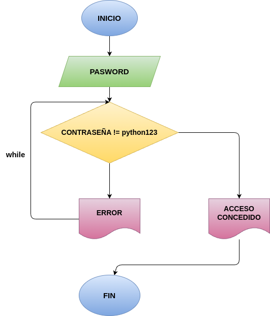

# PASSWORD
programa en python para dar el acceso si la contraseña coincide

## ANALISIS
### VARIABLES DE ENTRADA
- password
- correct_password="python123"

### PROCESO
while(password != correct_password):

    print("¡Error!: contraseña incorrecta")

    password=input("Digita de nuevo la contraseña: ")

    if(password == correct_password):
        print("ACCESO CONSEDIDO")

### VARIABLE DE SALIDA
- "ACCESO CONSEDIDO"

## DISEÑO

## CONSTRUCCIÓN
- Codigo implementado en el archivo "PASSWORD"