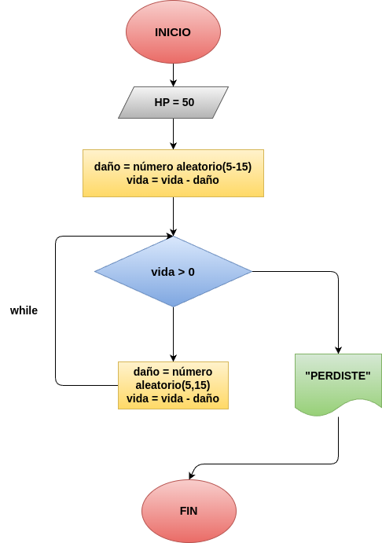

# Daño HP
programa en python para dar el acceso si la contraseña coincide

## ANALISIS
### VARIABLES DE ENTRADA
- HP =  50

### PROCESO
while True:
    daño= random.randint(5,15)

    HP= HP-daño

    print("El jefe te ataco y te quito " +str(HP) + " de vida restante")

    if(HP<=0):
        print("PERDISTE")
        break

### VARIABLE DE SALIDA
- "PERDISTE"

## DISEÑO

## CONSTRUCCIÓN
- Codigo implementado en el archivo "Daño HP"