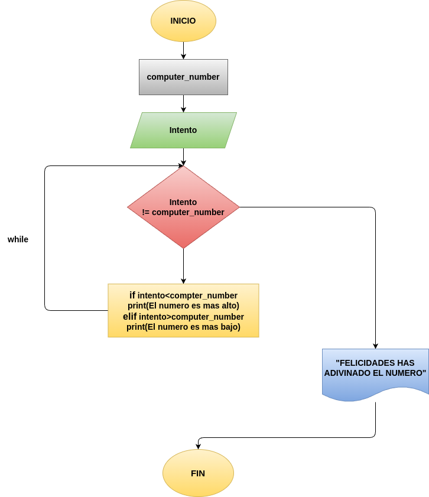

# "ADIVINA_EL_NUMERO"
programa en python para Adivinar el numero con intentos hastaa que  se logre

## ANALISIS
### VARIABLES DE ENTRADA
- password
- correct_password="python123"

### PROCESO
computer_number = random.randint(1,100)

intento= 0

while intento != computer_number:
    intento=int(input("Adivine el numero que es del 1 hasta el 100: "))

    if intento < computer_number:
        print("El numero es mas alto")
    elif intento > computer_number:
        print("El numero es mas bajo")

print("FELICIDADES HAS ADIVINADO EL NUMERO")
### VARIABLE DE SALIDA
- "FELICIDADES GRACIAS POR JUGAR"

## DISEÑO

## CONSTRUCCIÓN
- Codigo implementado en el archivo "ADIVINA_EL_NUMERO"