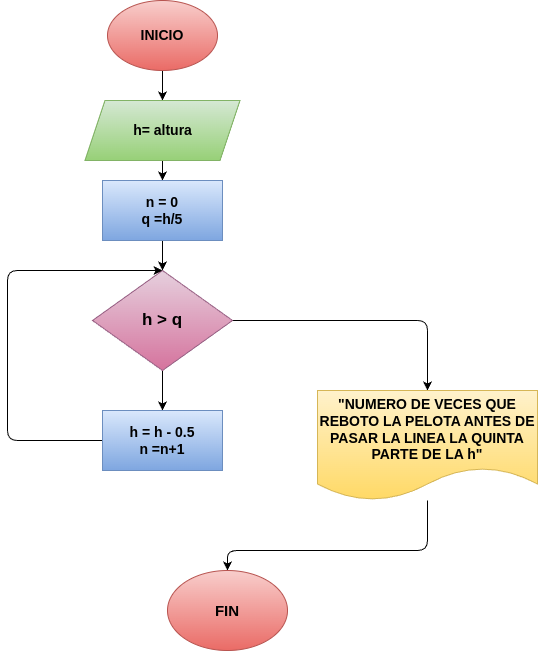

# "CUANTAS VECES REBOTO LA PELOTA"
programa en python para saber el numero de rebotes de la pelota

## ANALISIS
### VARIABLES DE ENTRADA
- h= altura a la que se lanza la pelota

### PROCESO
contador = 0

while (h > q):

    contador += 1
    h= h*0.5
    if h < q:
        print("NUMERO DE VECES QUE REBOTO LA PELOTA ANTES DE PASAR LA LINEA DE LA QUINTA PARTE DE LA h: ", contador)
### VARIABLE DE SALIDA
- FELICIDADES LA PELOTA REBOTO VARIAS VECES

## DISEÑO

## CONSTRUCCIÓN
- Codigo implementado en el archivo "CUANTAS VECES REBOTO LA PELOTA"