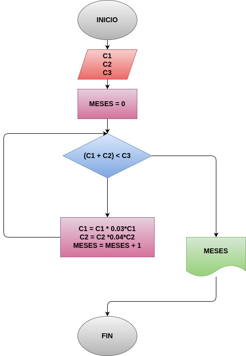

# "Meses para hacer el negocio"
programa en python para saber en cuantos meses se puede hacer el negocio de la capital

## ANALISIS
### VARIABLES DE ENTRADA
- c1 = capital pedro
- c2 = capital juan
- c3 = capital para el negocio

### PROCESO
while (C1 + C2 < C3):

    C1 = C1+0.03*C1
    C2 = C2+0.03*C2
    MESES= MESES + 1
### VARIABLE DE SALIDA
- "PEDRO Y JUAN PUEDEN HACER EL NEGOCIO A LOS x meses"
## DISEÑO

## CONSTRUCCIÓN
- Codigo implementado en el archivo "Meses para hacer el negocio"